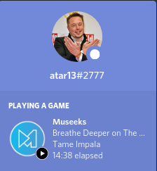

# museeks-discord-rpc

##### Discord RPC for the Museeks media player to update your discord status with Now Playing details from Museeks.

<p align="center">
  
</p>

## Installation
- Install **[Discord](https://discord.com/)**
- Install **[Museeks](https://museeks.io/)**
- Install **[NodeJS](https://nodejs.org/en/)**
- Clone this repository:
```clone
git clone https://github.com/atar13/museeks-discord-rpc.git
```
- Install npm dependencies
```npm_install
npm install
```
## Usage
- Launch **Discord**
- Launch **Museeks**
- Open the project directory
- Start the application using the rpc.js file
```node_rpc
node rpc.js
```
* **Note**: Museeks may be quit and re-launched multiple times. However, whenever Discord is quit museeks-discord-rpc must be relaunched as well. A fix is on the way for this issue.

## Configuration
Edit and save the options in the **config.json** file and run the rpc.js again.
### Options 
'checkForMuseeksRefreshTime' : Changes the duration between each time the application checks for Museeks.

More configuration options will be added soon.

---
## Notes 
*Only tested on Linux. Still need to do more tesing on Windows and MacOS.*
*A small menubar application or GUI is in the works and will be added soon.*
